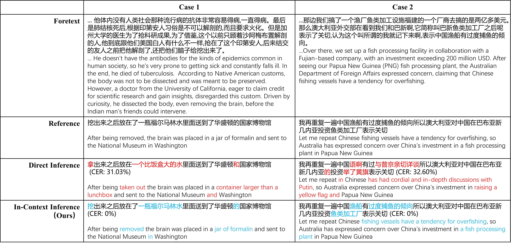

# VSR-LLM

This is the official implementation of the **VSR-LLM** paper.

---

## 🧠 Context-aware Decoding Example



---

## 🛠️ Preprocessing

We first detect the speaker's lip region in each video frame and crop the region of interest. These cropped frames are then resized to a uniform resolution of **96×96** pixels. The complete preprocessing pipeline follows the official CNVSRC baseline.

> 🔗 Please refer to the official preprocessing pipeline:  
> https://github.com/sectum1919/CNVSRC2024Baseline

---

## 🔗 Model Checkpoints

After preprocessing, you need to download the following pre-trained models:

1. **Language Model (Qwen2.5):**  
   We use the Qwen2.5 series as the backbone LLM.  
   👉 https://huggingface.co/collections/Qwen/qwen25-66e81a666513e518adb90d9e

2. **Visual Encoder:**  
   The encoder is trained following CNVSRC baseline, model name:  
   `model_avg_cncvs_cnvsrc-single.pth`  
   👉 https://www.modelscope.cn/models/chenchen2121/CNVSRC2024Baseline/files

Please place the downloaded models in the following directories:

```
checkpoints/
├── visual_decoder/
│ └── Qwen2.5-xx/
├── visual_encoder/
│ └── conformer.py
│ └── conformer.yaml
│ └── model_avg_cncvs_cnvsrc-single.pth
```

---

After finishing above process, you can rewrite **train.sh** and **infer.sh** with the right path according to the instruction in these two scripts.

## 🚀 Running Training and Inference

We provide training and inference scripts for both **Context-aware decoding** and **Iterative decoding** experiments.

### 🔧 Step 1: Create and activate environment

```
conda env create -f vsr_llm_env.yaml
conda activate vsr_llm
```
### Step 2: Context-aware decode training and inference

```
cd exp/Context_aware_exp
bash train.sh    # Start training
bash infer.sh    # Run inference
```

### Step 3: Context-aware decode training and inference

```
cd exp/Context_aware_exp
bash train.sh    # Start training
bash infer.sh    # Run inference
```